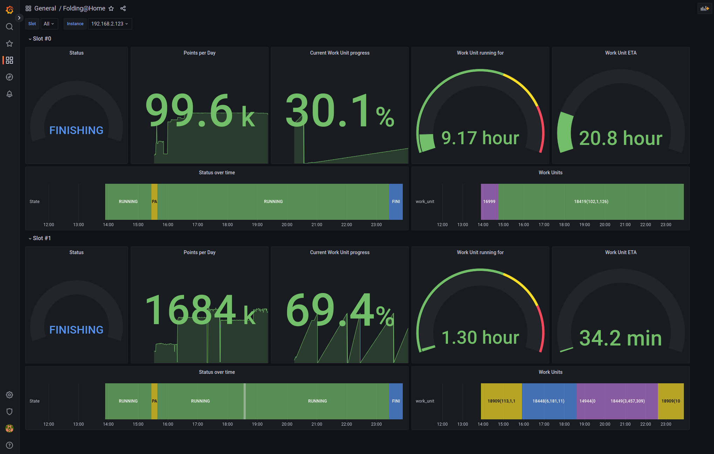

# F@H Telnet Exporter for Prometheus
Prometheus exporter for Folding@Home client metrics. Can be run standalone or as a Docker container. Exporter is stateless, and a single instance can retrieve data from multiple folding clients.



## Usage
### Prerequisites
Configure your F@H client to accept requests from the exporter:
1. Set `allow` option to an IP range that includes the IP of the FAH Exporter (e.g. `0/0` will allow all addresses).
2. Configure authorization. Here you have 2 options:
* Setting the `command-allow-no-pass` option to an IP range that includes the IP of the FAH Exporter (e.g. `0/0` will allow all addresses)
* Setting a password using the `password` option. In that case you will need to make sure to provide this password to the exporter.

Also, make sure your `command-enable` is set to `true` (that should be the default setting).
### Running
#### Docker
```
docker run -p 3003:3003 -d grappeq/fah-telnet-exporter
```

#### Docker Compose
```yaml
version: "3.9"
services:
  fah-telnet-exporter:
    image: grappeq/fah-telnet-exporter
    restart: unless-stopped
    ports:
      - 3003:3003
```

#### Standalone
**Requirements**: Node v18, npm
```
npm install
npm run build
npm run start:dist
```

### Testing
To see if exporter is working and able to connect to your F@H client, open `http://<exporter-address>:3003/metrics?target=<fah-client-addres>` in your browser. 

If both exporter and F@H client are running locally you can just click on this link: [http://localhost:3003/metrics?target=localhost](http://localhost:3003/metrics?target=localhost).

### Prometheus config
Standard Prometheus config should look something along those lines:
```yaml
scrape_configs:
  - job_name: "fah"
    scrape_interval: 1m
    static_configs:
    - targets: ["<fah-telnet-exporter-address>:3003"]
    params:
      port: ["36330"]
      target: ["<your-fah-client-address>"]
#      password: ["kasztan"] # optional, set it only if you have defined a password in the F@H client settings
```
Avoid scraping too often (like every few seconds) as fetching metrics will fail if the exporter starts a new transaction before finishing the old one. Scraping every 30+ seconds should keep you out of trouble.

#### Multiple targets in a single job
If you wish to specify multiple F@H clients as targets within a single job you can use [relabeling](https://prometheus.io/docs/prometheus/latest/configuration/configuration/#relabel_config):
```yaml
scrape_configs:
  - job_name: 'fah'
    scrape_interval: 1m
    static_configs:
      - targets:
          - <your-fah-client1-address>
          - <your-fah-client2-address>
    metrics_path: /metrics
    params:
      port: ["36330"]
#      password: ["kasztan"] # optional, set it only if you have defined a password in the F@H client settings
    relabel_configs:
      - source_labels: [__address__]
        target_label: __param_target
      - source_labels: [__param_target]
        target_label: instance
      - target_label: __address__
        replacement: <fah-telnet-exporter-address>:3003
``` 

## How it works
Exporter is a stateless service that fetches Folding@Home client metrics using [F@H telnet interface](https://github.com/FoldingAtHome/fah-control/wiki/3rd-party-FAHClient-API) and exposes them to Prometheus in [the text-based format](https://prometheus.io/docs/instrumenting/exposition_formats/#text-based-format) via `/metrics` endpoint. It uses the [multi-target exporter pattern](https://prometheus.io/docs/guides/multi-target-exporter/) allowing you to expose metrics from multiple F@H clients using a single instance of the exporter.

### API
Exporter exposes 2 HTTP endpoints:
* `GET /metrics`: returns metrics meant to be consumed by Prometheus.
* `GET /raw`: returns raw JSON objects fetched from the F@H client. Useful for debugging or if you want to get data that was not mapped to metrics.

Both endpoints expect the same request format:

| Query param | Type | Description |
| ----------- | ----------- | ----------- |
| target | string, required | IP or hostname of the Folding@Home client |
| port | integer, optional (default: `36330`) | Port under which telnet interface of the F@H client is exposed. With default settings this is 36330. |
| password | string, optional (default: `null`) | Password used to authenticate into the F@H client. If you have set `command-allow-no-pass` F@H option to an IP range containing the Exporter, skip this param. You can also provide the password using `FAH_AUTH_PASSWORD` env var. Password provided in the query param, is used over the one set in the env var. |

### Exporter env var settings
| Env var name | Type | Description |
| ----------- | ----------- | ----------- |
| FAH_AUTH_PASSWORD | string, optional | Password used to authenticate into the F@H client. |
| METRIC_PREFIX | string, optional (default: `fah_`) | Prefix appended before each metric. |
| PORT | integer, optional (default: `3003`) | Port where the HTTP server should be running. |

### Metrics exported
```
# TYPE fah_slot_idle gauge
fah_slot_idle{slot="0"} 0

# TYPE fah_slot_running gauge
fah_slot_running{slot="0"} 1

fah_slot_status{slot="0",status="RUNNING"} 1

# TYPE fah_queue_project gauge
fah_queue_project{queue="00",slot="0",work_unit_project="16999",work_unit_clone="56",work_unit_run="36",work_unit_gen="115",work_unit="16999(36,56,115)"} 16999

# TYPE fah_queue_percent_done gauge
fah_queue_percent_done{queue="00",slot="0",work_unit_project="16999",work_unit_clone="56",work_unit_run="36",work_unit_gen="115",work_unit="16999(36,56,115)"} 0.01

# TYPE fah_queue_points_per_day gauge
fah_queue_points_per_day{queue="00",slot="0",work_unit_project="16999",work_unit_clone="56",work_unit_run="36",work_unit_gen="115",work_unit="16999(36,56,115)"} 17937

# TYPE fah_queue_credit_estimate gauge
fah_queue_credit_estimate{queue="00",slot="0",work_unit_project="16999",work_unit_clone="56",work_unit_run="36",work_unit_gen="115",work_unit="16999(36,56,115)"} 9446

# TYPE fah_queue_credit_base gauge
fah_queue_credit_base{queue="00",slot="0",work_unit_project="16999",work_unit_clone="56",work_unit_run="36",work_unit_gen="115",work_unit="16999(36,56,115)"} 3540

# TYPE fah_queue_frames_total gauge
fah_queue_frames_total{queue="00",slot="0",work_unit_project="16999",work_unit_clone="56",work_unit_run="36",work_unit_gen="115",work_unit="16999(36,56,115)"} 0

# TYPE fah_queue_frames_done gauge
fah_queue_frames_done{queue="00",slot="0",work_unit_project="16999",work_unit_clone="56",work_unit_run="36",work_unit_gen="115",work_unit="16999(36,56,115)"} 0

# TYPE fah_queue_eta_days gauge
fah_queue_eta_days{queue="00",slot="0",work_unit_project="16999",work_unit_clone="56",work_unit_run="36",work_unit_gen="115",work_unit="16999(36,56,115)"} 12

# TYPE fah_queue_state gauge
fah_queue_state{queue="00",slot="0",work_unit_project="16999",work_unit_clone="56",work_unit_run="36",work_unit_gen="115",work_unit="16999(36,56,115)",state="RUNNING"} 1

# TYPE fah_simulation_eta_seconds gauge
fah_simulation_eta_seconds{slot="0",work_unit_project="16999",work_unit_clone="56",work_unit_run="36",work_unit_gen="115",user="fancy_user",team="123456",work_unit="16999(36,56,115)"} 45495

# TYPE fah_simulation_deadline_timestamp gauge
fah_simulation_deadline_timestamp{slot="0",work_unit_project="16999",work_unit_clone="56",work_unit_run="36",work_unit_gen="115",user="fancy_user",team="123456",work_unit="16999(36,56,115)"} 1676207590

# TYPE fah_simulation_timeout_timestamp gauge
fah_simulation_timeout_timestamp{slot="0",work_unit_project="16999",work_unit_clone="56",work_unit_run="36",work_unit_gen="115",user="fancy_user",team="123456",work_unit="16999(36,56,115)"} 0

# TYPE fah_simulation_start_timestamp gauge
fah_simulation_start_timestamp{slot="0",work_unit_project="16999",work_unit_clone="56",work_unit_run="36",work_unit_gen="115",user="fancy_user",team="123456",work_unit="16999(36,56,115)"} 1675775590
```

## Example: F@H + Prometheus + Exporter
Below you can see an example Docker Compose config of a Folding@Home client container running together with Prometheus and the exporter. To get it started, just execute `docker compose up -d` after creating appropriate files.

#### docker-compose.yaml
```yaml
version: "3.9"
services:
  fah-telnet-exporter:
    image: grappeq/fah-telnet-exporter
    restart: unless-stopped
    ports:
      - 3004:3003
  prometheus:
    image: prom/prometheus:latest
    restart: unless-stopped
    volumes:
      - ./prometheus.yml:/etc/prometheus/prometheus.yml
      - prometheus-data:/prometheus
    command:
      - '--config.file=/etc/prometheus/prometheus.yml'
      - '--storage.tsdb.path=/prometheus'
    ports:
      - 9090:9090
  folding-at-home-cpu:
    image: yurinnick/folding-at-home:latest
    container_name: folding-at-home-cpu
    environment:
      - USER=grappeq
      - ENABLE_GPU=false
      - ENABLE_SMP=true
      - PUID=1000
      - PGUI=1000
      - POWER=light
      - ALLOWED_HOSTS=0/0
      - EXTRA_OPTIONS=--command-allow-no-pass 0/0
    volumes:
      - fah-data:/opt/fahclient/work
    ports:
      - 7397:7396

volumes:
  prometheus-data:

  fah-data:

```

#### prometheus.yaml
```yaml
global:
  scrape_interval: 1m

scrape_configs:
  - job_name: "prometheus"
    static_configs:
    - targets: ["localhost:9090"]
  - job_name: "fah"
    static_configs:
    - targets: ["fah-telnet-exporter:3003"]
    params:
      port: ["36330"]
      target: ["folding-at-home-cpu"]
```

## Grafana dashboard
If you like the Grafana dashboard from the screenshot at the top of the page, you can import it using [this file](./examples/grafana/grafana-fah-dashboard.json).